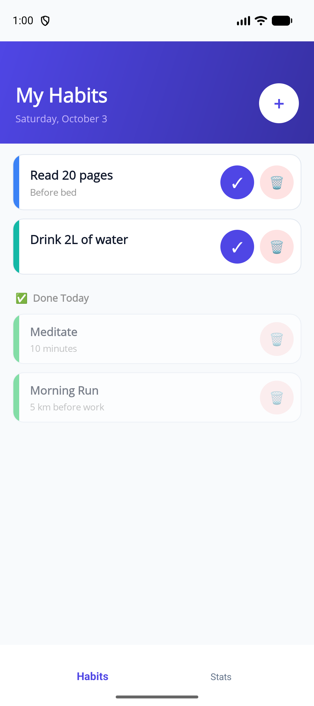
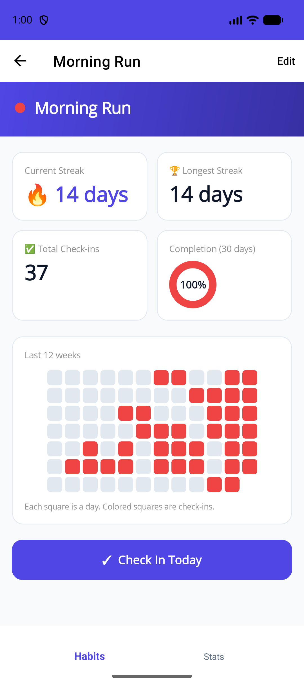
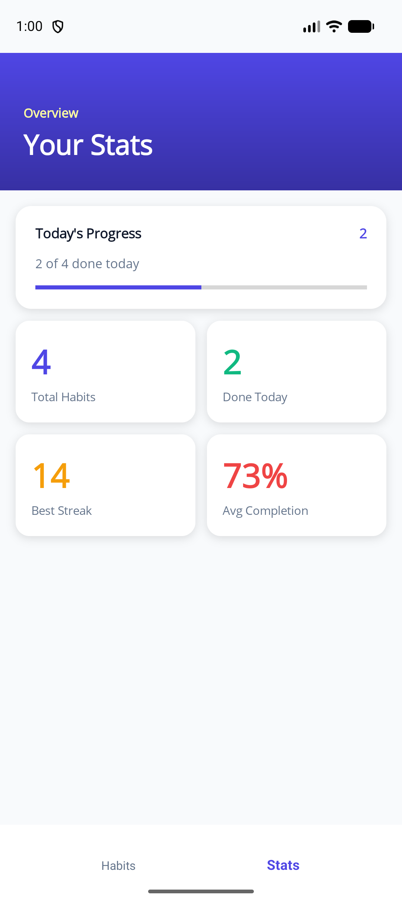
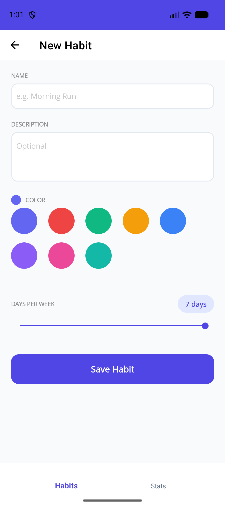
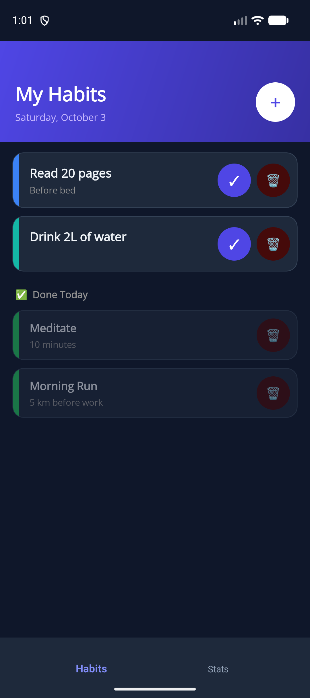
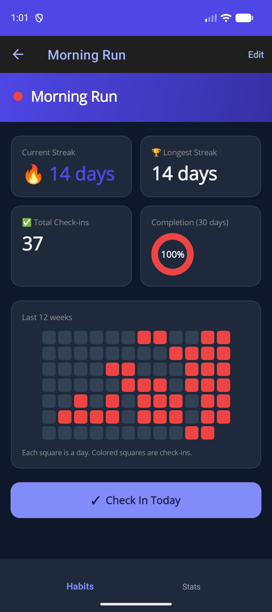
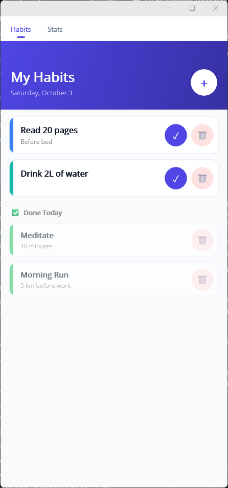
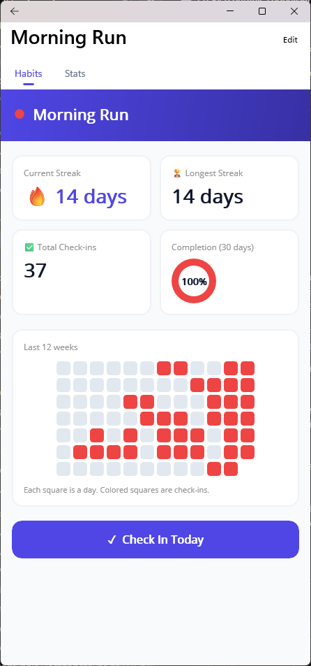
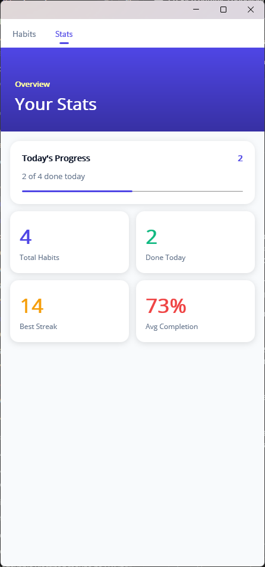
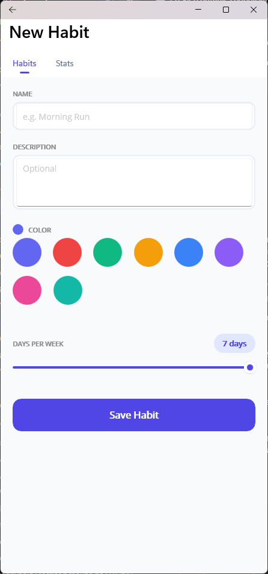

# HabitStreakTracker

[](https://github.com/Marokos999/HabitStreakTracker/actions/workflows/ci.yml)

A habit tracking app with streak statistics: a **.NET MAUI** mobile client talking to a **serverless .NET 10 API** on AWS (Lambda, API Gateway, DynamoDB, Cognito).

## Screenshots

Android, light and dark theme:

<p align="center">
  
  
  
  
</p>

<p align="center">
  
  
</p>

Windows:

<p align="center">
  
  
  
  
</p>

## Features

- Create, edit and archive habits (daily or weekly, color, target days per week)
- Daily check-ins with optional notes
- Current streak, longest streak and completion rate per habit
- Summary across all habits
- Cognito-based authentication (JWT) with per-user data isolation

## Architecture

```
┌──────────────┐   HTTPS + JWT   ┌───────────────┐      ┌──────────────┐      ┌───────────┐
│  .NET MAUI   │ ──────────────▶ │  API Gateway  │ ───▶ │ Lambda (.NET)│ ───▶ │ DynamoDB  │
│  mobile app  │                 │  (HTTP API)   │      │  functions   │      │ single    │
└──────┬───────┘                 └───────┬───────┘      └──────────────┘      │ table     │
       │ OAuth2 code flow                │ JWT authorizer                      └───────────┘
       ▼                                 ▼
┌─────────────────────────────────────────────┐
│               Amazon Cognito                │
└─────────────────────────────────────────────┘
```

The backend follows Clean Architecture:

| Project | Responsibility |
|---|---|
| `HabitTracker.Domain` | Entities, enums, `StreakCalculator` (pure logic, no dependencies) |
| `HabitTracker.Application` | Command/query handlers, validation, repository interfaces |
| `HabitTracker.Infrastructure` | DynamoDB repositories (single-table design with a GSI) |
| `HabitTracker.Functions` | Lambda entry points, HTTP mapping, error handling |
| `HabitTracker.Mobile` | .NET MAUI app (MVVM) |
| `HabitTracker.Tests` | xUnit unit and integration tests |

## Tech stack

.NET 10 · AWS Lambda (Powertools: logging, tracing, metrics) · AWS SAM · API Gateway HTTP API · DynamoDB · Cognito · .NET MAUI · xUnit · Moq · Docker (DynamoDB Local)

## API

All endpoints require a Cognito JWT (`Authorization: Bearer <token>`). Errors are returned as `{ "error": "..." }`.

| Method | Path | Description |
|---|---|---|
| `GET` | `/habits?date=yyyy-MM-dd` | List habits, each with `checkedInToday` for the given day (defaults to today in UTC) |
| `POST` | `/habits` | Create a habit |
| `PUT` | `/habits/{id}` | Update a habit |
| `DELETE` | `/habits/{id}` | Archive a habit |
| `GET` | `/habits/{id}/stats` | Streak statistics for a habit, plus `checkInDates` of the last 12 weeks (used for the heatmap). Completion rate compares the last 30 days with the habit's `targetDaysPerWeek` |
| `POST` | `/checkins` | Create a check-in (`habitId`, `date`, `note`) |
| `DELETE` | `/checkins/{habitId}/{date}` | Delete a check-in (`date` as `yyyy-MM-dd`) |
| `GET` | `/stats/summary` | Summary across all habits |

Status codes: `400` validation error, `401` missing identity, `404` not found (including habits owned by someone else), `409` conflict, `500` unexpected error.

Example habit body:

```json
{
  "name": "Exercise",
  "description": "30 minutes",
  "frequency": 0,
  "color": "#6366F1",
  "targetDaysPerWeek": 5
}
```

`frequency`: `0` = Daily, `1` = Weekly.

## Getting started

### Prerequisites

- [.NET 10 SDK](https://dotnet.microsoft.com/download)
- [Docker](https://www.docker.com/)
- [AWS SAM CLI](https://docs.aws.amazon.com/serverless-application-model/latest/developerguide/install-sam-cli.html) and AWS CLI
- .NET MAUI workload for the mobile app: `dotnet workload install maui`

### Run the API locally

```bash
# 1. Start DynamoDB Local
docker compose up -d

# 2. Create the table (any dummy AWS credentials work for DynamoDB Local)
pwsh scripts/create-table.ps1

# 3. Build and start the API on http://127.0.0.1:3000
sam build
sam local start-api --env-vars env.json --docker-network lambda-local
```

`env.json` sets `IS_LOCAL=true`, which points the functions at DynamoDB Local and uses a fixed `local-test-user` identity (there is no authorizer locally). In a deployed environment a missing Cognito identity returns `401`.

### Run the mobile app

In `DEBUG` builds the app uses `DevAuthService` (no login) and calls `http://127.0.0.1:3000` (`http://10.0.2.2:3000` on the Android emulator).

```bash
dotnet build src/HabitTracker.Mobile -f net10.0-android
```

Release builds sign in through the Cognito hosted UI using the authorization code flow with PKCE. Access tokens are refreshed automatically with the refresh token and stored in the platform secure storage. After deploying, fill in `domain` and `clientId` in `Resources/Raw/cognito.json` and `baseUrl` in `Resources/Raw/api.json` (see below). Release builds talk to the API over HTTPS only; plain HTTP is enabled for Debug builds. Read requests are retried with backoff, and API errors are shown to the user as readable messages.

### Tests

```bash
dotnet test tests/HabitTracker.Tests
```

The integration tests in `Integration/` start a throwaway DynamoDB Local container via Testcontainers, so Docker must be running. To skip them: `dotnet test tests/HabitTracker.Tests --filter "Category!=Integration"`.

## Deploy to AWS

```bash
sam build
sam deploy --guided
```

The stack creates the DynamoDB table, a Cognito user pool, hosted UI domain and app client (authorization code flow with PKCE), the HTTP API with a JWT authorizer and all Lambda functions. After deploying, copy the outputs `CognitoDomain` and `UserPoolClientId` into `src/HabitTracker.Mobile/Resources/Raw/cognito.json` (`domain`, `clientId`), and the output `ApiUrl` into `Resources/Raw/api.json` (`baseUrl`).

## Observability

The Lambda functions use AWS Lambda Powertools: structured JSON logs (with request id and cold start), X-Ray tracing (including DynamoDB calls) and CloudWatch custom metrics in the `HabitTracker` namespace (`HabitCreated`, `HabitDeleted`, `CheckInCreated`, `CheckInDeleted`, `ColdStart`). Tracing is enabled by `Tracing: Active` in `template.yaml` and is skipped for local runs.

## License

[MIT](LICENSE)
